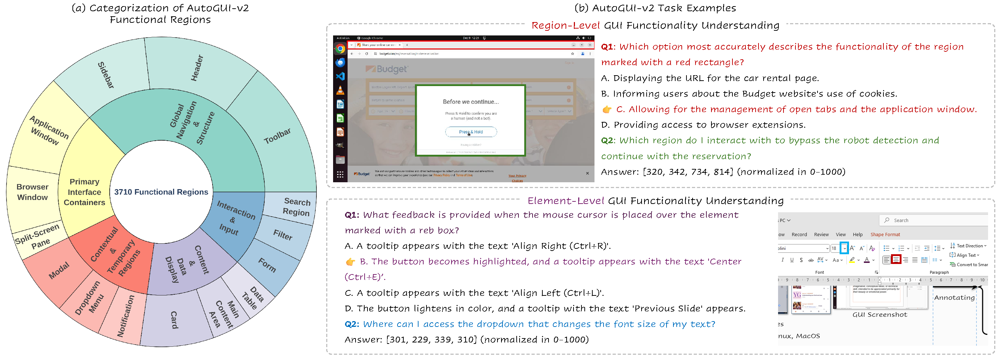
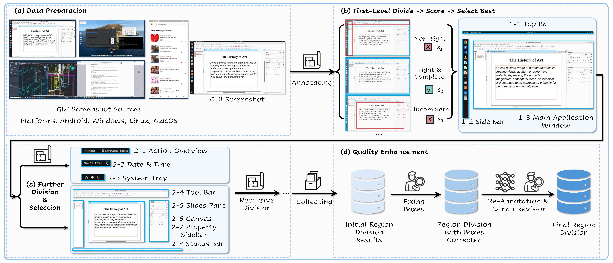

<div align="center">

# AutoGUI-v2

### *Functional GUI Understanding through Hierarchical Region Decomposition*

[](assets/AutoGUIv2.pdf)
[](https://ZJULiHongxin.github.io/AutoGUI-v2)
[](https://huggingface.co/datasets/AutoGUI/AutoGUIv2-FuncElemGnd)
[](https://huggingface.co/datasets/AutoGUI/AutoGUIv2-FuncRegionGnd)
[](https://huggingface.co/datasets/AutoGUI/AutoGUIv2-FuncRegionCap)
[](https://www.python.org/downloads/)
[](LICENSE)

**AutoGUI-v2 introduces functional GUI understanding: rather than simply detecting what elements *look like*, it asks what they *do* — and whether models can tell apart elements that look the same but behave differently.**

[Overview](#-overview) · [Tasks](#-benchmark-tasks) · [Installation](#-installation) · [Quick Start](#-quick-start) · [Pipeline](#-pipeline-architecture) · [Citation](#-citation)



</div>

---

## Overview

GUIs are full of elements that look identical but do completely different things — three arrow icons on the same screen, each triggering a different action. Standard benchmarks miss this entirely, testing only whether a model can spot an element from a description that perfectly matches its visual appearance.

**AutoGUI-v2** closes this gap with:

1. **A hierarchical annotation pipeline** that uses LLMs to decompose any GUI screenshot into a tree of functional regions — automatically, at scale, with quality verification.
2. **FuncElemGnd** — an element-level grounding benchmark where distractors are *visually similar elements with different functions*, not random GUI noise.
3. **FuncElemCap** — a functional captioning benchmark testing whether a model can predict the *outcome* of interacting with a specific element.
4. **FuncRegionGnd / FuncRegionCap** — region-level tasks built on top of the hierarchical annotations, using semantic clustering and visual verification to ensure cluster quality.

| Traditional Benchmarks | AutoGUI-v2 |
|:----------------------:|:----------:|
| "Which element matches this description?" | "Which of these similar-looking elements does *this specific thing*?" |
| Flat element lists | Hierarchical functional regions |
| Visual similarity as signal | Visual similarity as *challenge* |
| Single dataset | 7 diverse GUI datasets |

---

## Benchmark Tasks

### FuncElemGnd — Functional Element Grounding

Given a GUI screenshot and a functional question (e.g. *"Which button will close only this tab, not the whole browser?"*), locate the correct element from a group of visually similar distractors. The key challenge: hard negatives are not random — they are elements that *look identical* but do something else.

Three question variants test different reasoning depths:
- **FuncGnd** — direct functional question about what clicking does
- **DescGnd** — description-based grounding (element appearance + function)
- **IntentGnd** — action-intent grounding ("I want to X, which element should I click?")

### FuncElemCap — Functional Element Captioning

Multiple-choice QA: given the element, predict the outcome of interacting with it. Hard negatives are the captions of visually similar sibling elements. Tests whether a model truly understands element *semantics*, not just appearance.

### FuncRegionGnd / FuncRegionCap — Region-Level Tasks

Built from the hierarchical decomposition tree. Groups of functionally similar but visually distinct regions are verified by:
1. **Semantic clustering** (Qwen3-Embedding-8B) on region descriptions
2. **Visual verification** (Gemini Vision) to confirm visual similarity
3. **LLM-generated questions** for grounding and open-ended QA

---

## Installation

```bash
git clone https://github.com/ZJULiHongxin/AutoGUI-v2.git
cd AutoGUI-v2

pip install torch torchvision opencv-python pillow colorama tqdm
pip install datasets huggingface_hub openai anthropic megfile
pip install fastapi uvicorn rich        # monitoring web UI
pip install vllm                        # local embedding model (FuncRegionGnd)
```

```bash
export OPENAI_API_KEY="your-openai-key"
export GEMINI_API_KEY="your-gemini-key"
export ANTHROPIC_API_KEY="your-anthropic-key"
```

---

## Quick Start

### Step 1 — Annotate Functional Regions

Feed any GUI screenshot dataset into the hierarchical annotator. It decomposes each image into a tree of functional regions, runs dual-model quality checking (completeness + tight bounding), and caches results for incremental runs.

```bash
python utils/data_utils/autoguiv2/annotate_functional_regions.py \
    --data-path "HongxinLi/ScreenSpot-Pro" \
    --model "gpt-4o" \
    --checking-model "gemini-2.5-pro-thinking" \
    --output-dir "./annotations" \
    --workers 4 \
    --max-level 3
```

**Supported `--data-path` values:** `HongxinLi/ScreenSpot-Pro`, `osworld-g`, `agentnet`, `android_control`, `gui_odyssey`, `amex`, `magicui`, or a local image directory.

**Key parameters:**

| Flag | Default | Description |
|------|---------|-------------|
| `--model` | `gemini-2.5-pro-thinking` | Primary LLM for annotation |
| `--checking-model` | `gemini-2.5-pro-thinking` | Quality verification model |
| `--max-level` | `-1` (unlimited) | Max hierarchy depth |
| `--workers` | `1` | Parallel workers |
| `--completeness-threshold` | `2.5` | 0–3 scale; higher = stricter |
| `--boundedness-threshold` | `0.8` | 0–1 ratio; higher = tighter boxes |

---

### Step 2 — Generate FuncElemGnd / FuncElemCap Tasks

```bash
# 2a. Detect visually similar elements with different functions
python utils/data_utils/autoguiv2/FuncElemGnd_eval_gen/1_make_func_elemgnd_samples.py \
    --anno-path "./annotations/functional_regions.json" \
    --output-dir "./tasks/elemgnd"

# 2b. Generate functional grounding questions
python utils/data_utils/autoguiv2/FuncElemGnd_eval_gen/2_generate_func_elemgnd_questions.py \
    --samples-file "./tasks/elemgnd/samples.json" \
    --output-dir "./tasks/elemgnd" \
    --model "gpt-4o"

# 2c. Generate functional captioning questions (FuncElemCap)
python utils/data_utils/autoguiv2/FuncElemGnd_eval_gen/3_generate_func_captioning_questions.py \
    --samples-file "./tasks/elemgnd/samples.json" \
    --output-dir "./tasks/elemcap" \
    --model "gpt-4o"

# 2d. Upload to HuggingFace
python utils/data_utils/autoguiv2/FuncElemGnd_eval_gen/21_convert_elemgnd_to_hf_dataset.py \
    --questions-file "./tasks/elemgnd/grounding_questions.json" \
    --repo-id "username/autoguiv2-funcelem" \
    --include-images
```

---

### Step 3 — Generate FuncRegionGnd / FuncRegionCap Tasks

Two-stage pipeline: semantic clustering → visual verification → question generation.

```bash
# Grounding mode: locate a region on-screen
python utils/data_utils/autoguiv2/FuncElemQA_eval_gen/gen_region-func_multichoice-qa.py \
    --anno-path "./annotations/functional_regions.json" \
    --output-dir "./tasks/regiongnd" \
    --model "gemini-2.5-pro" \
    --mode "grounding"

# QA mode: text-based multi-choice questions about region function
python utils/data_utils/autoguiv2/FuncElemQA_eval_gen/gen_region-func_multichoice-qa.py \
    --anno-path "./annotations/functional_regions.json" \
    --output-dir "./tasks/regionqa" \
    --model "gemini-2.5-pro" \
    --mode "qa"
```

---

### Step 4 — Evaluate Models

```bash
# Evaluate on FuncElemGnd
python utils/eval_utils/autoguiv2/eval_elemgnd_mp.py \
    --model "gpt-4o" \
    --dataset-path "./tasks/elemgnd/dataset" \
    --output-dir "./results" \
    --workers 8

# Evaluate on ScreenSpot-v2
python utils/eval_utils/autoguiv2/eval_screenspotv2_mp.py \
    --model "gpt-4o" \
    --output-dir "./results" \
    --workers 8

# Evaluate on OSWorld-G
python utils/eval_utils/autoguiv2/eval_osworldg_mp.py \
    --model "gpt-4o" \
    --output-dir "./results" \
    --workers 8

# Visualize results
python utils/eval_utils/autoguiv2/vis_utils/visualize_elemgndcap_result.py \
    --result-path "./results/gpt-4o.json" \
    --output-dir "./visualizations"
```

Metrics reported: **Center Accuracy**, **IoU@0.5**, **Average IoU**, broken down by action type, element density, and number of similar elements.

Supported models out of the box: `gpt-4o`, `gemini-*`, `claude-*`, `qwen*`, `ui-tars`, `atlas`, `uground`, `jedi`, `doubao`, `stepfun`, and HuggingFace endpoint models.

---

### Step 5 — Monitor & Revise Annotations

```bash
python utils/data_utils/autoguiv2/monitor/server_bboxcorrection_v2.py \
    --cache-dir "./annotations/cache" \
    --port 17800
# Open http://localhost:17800
```

The web UI lets you inspect annotation progress in real time, correct bounding boxes interactively, and trigger re-annotation for failed cases.

---

## Pipeline Architecture

<div align="center">


</div>

```
GUI Screenshots (any dataset)
         │
         ▼
┌─────────────────────────────────────┐
│   Hierarchical Region Annotator     │
│   annotate_functional_regions.py    │
│                                     │
│   LLM decomposes image → region     │
│   tree. Dual-model quality check:   │
│   • Completeness  (gemini)          │
│   • Boundedness   (gemini)          │
│   Caching + parallel processing     │
└─────────────────────────────────────┘
         │
    ┌────┴────┐
    ▼         ▼
┌──────────┐  ┌──────────────────────┐
│ Element  │  │ Region-Level Tasks   │
│  Tasks   │  │ FuncElemQA_eval_gen/ │
│          │  │                      │
│ 1. Find  │  │ 1. Semantic cluster  │
│  similar │  │    (Qwen3-Embed-8B)  │
│  elems   │  │ 2. Visual verify     │
│          │  │    (Gemini Vision)   │
│ 2. Gen   │  │ 3. Gen grounding /   │
│  gnd Qs  │  │    text-based QA     │
│          │  │                      │
│ 3. Gen   │  │ → FuncRegionGnd      │
│  cap Qs  │  │ → FuncRegionCap      │
│          │  └──────────────────────┘
│ →FuncElem│
│  Gnd/Cap │
└──────────┘
         │
         ▼
┌─────────────────────────────────────┐
│   Model Evaluation                  │
│   eval_utils/autoguiv2/             │
│   • Center Acc / IoU metrics        │
│   • Multi-benchmark support         │
│   • Parallel multiprocessing        │
└─────────────────────────────────────┘
```

---

## Directory Structure

```
AutoGUI-v2/
├── assets/
│   └── AutoGUIv2.pdf
│
├── project_page/               ← GitHub Pages project website
│   └── index.html
│
└── utils/
    ├── data_utils/
    │   └── autoguiv2/
    │       ├── annotate_functional_regions.py  ← Main annotation script
    │       ├── data_loaders.py                 ← Dataset loaders
    │       │
    │       ├── FuncElemGnd_eval_gen/           ← Element-level task gen
    │       │   ├── 1_make_func_elemgnd_samples.py
    │       │   ├── 2_generate_func_elemgnd_questions.py
    │       │   ├── 3_generate_func_captioning_questions.py
    │       │   ├── 21_convert_elemgnd_to_hf_dataset.py
    │       │   ├── 31_convert_elemcap_to_hf_dataset.py
    │       │   └── 4_calc_task_attributes.py
    │       │
    │       ├── FuncElemQA_eval_gen/            ← Region-level task gen
    │       │   └── gen_region-func_multichoice-qa.py
    │       │
    │       ├── monitor/                        ← Annotation web UI
    │       │   ├── server_bboxcorrection_v2.py
    │       │   ├── revise_elemgnd_tasks_v2.py
    │       │   └── revise_regiongnd_tasks.py
    │       │
    │       ├── detect_all_elems/
    │       ├── embed_and_cluster/
    │       ├── classify_region_types/
    │       └── calc_dataset_statistics/
    │
    └── eval_utils/
        └── autoguiv2/
            ├── eval_elemgnd_mp.py
            ├── eval_screenspotv2_mp.py
            ├── eval_osworldg_mp.py
            ├── eval_mind2web_mp.py
            ├── eval_androidcontrol_mp.py
            └── vis_utils/
```

---

## Supported Source Datasets

| Dataset | Domain | Scale |
|---------|--------|-------|
| **ScreenSpot-Pro** | Web, Mobile, Desktop | Professional-grade GUIs |
| **OSWorld-G** | Desktop OS | 250 unique screenshots |
| **AgentNet** | Mixed | Large-scale trajectories |
| **AMEX** | Mobile | Action & environment |

<!-- | **AndroidControl** | Mobile (Android) | Touch interactions |
| **GUIOdyssey** | Mobile | Long-horizon tasks | -->
<!-- | **MagicUI** | Mixed | High-diversity GUIs | -->

---

## Citation

If you use AutoGUI-v2 in your research, please cite:

```bibtex
@article{autoguiv2,
  title     = {AutoGUI-v2: Functional GUI Understanding through Hierarchical Region Decomposition},
  author    = {Li, Hongxin and others},
  journal   = {arXiv preprint},
  year      = {2025}
}
```

### Related Work

- [ScreenSpot-Pro](https://huggingface.co/datasets/HongxinLi/ScreenSpot-Pro) — Professional GUI grounding benchmark
- [OmniParser](https://github.com/microsoft/OmniParser) — Unified screen parsing
- [OSWorld](https://os-world.github.io/) — Desktop environment for GUI agents
- [UI-TARS](https://github.com/bytedance/UI-TARS) — GUI agent model

---

## Acknowledgments

Thanks to OpenAI, Google, and Anthropic for API access; HuggingFace for dataset hosting; and the GUI understanding community for open benchmarks that made this work possible.

---

<div align="center">

**⭐ Star this repo if you find AutoGUI-v2 useful!**

[⬆ Back to Top](#autogui-v2)

</div>
